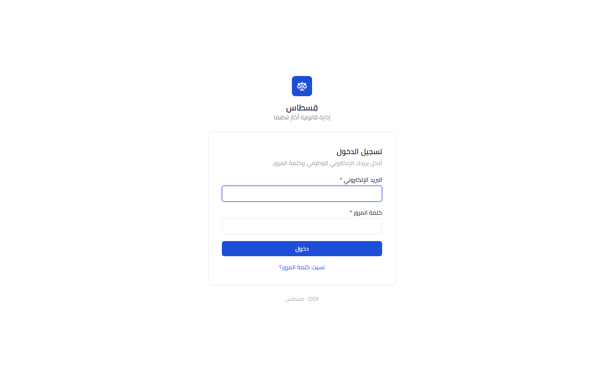
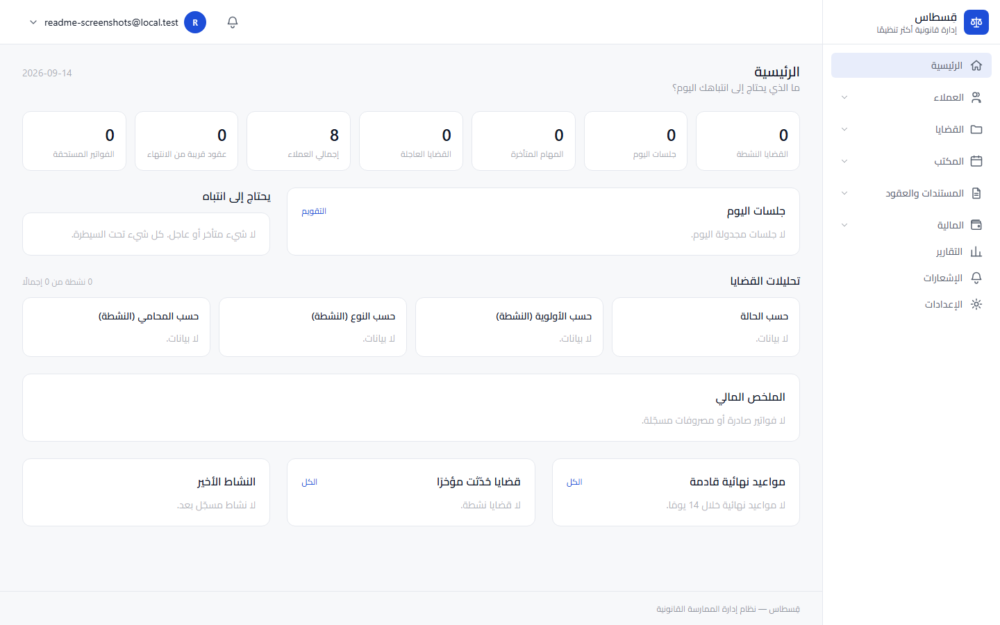
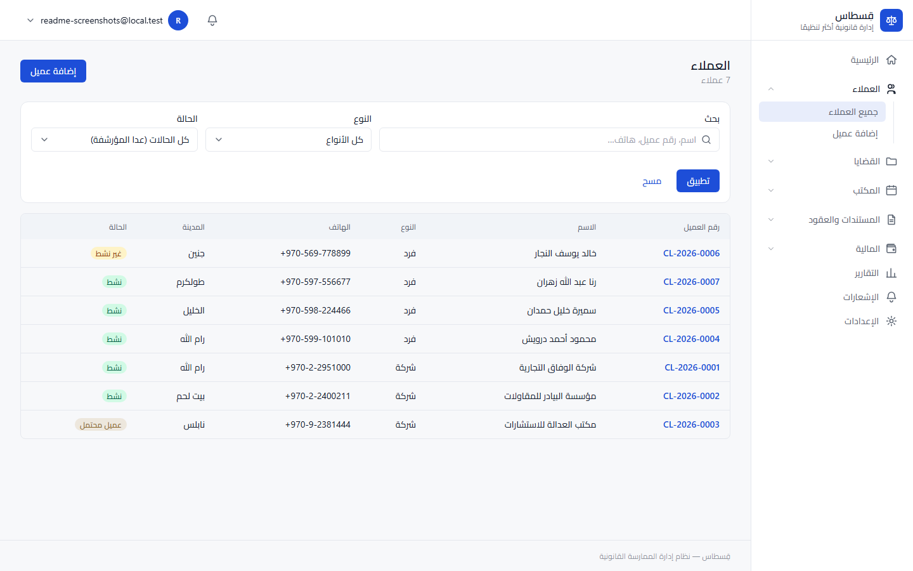
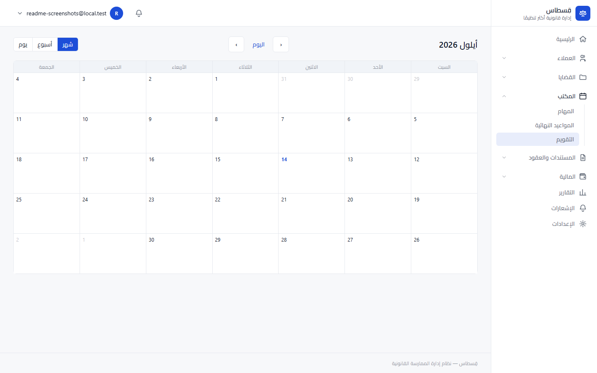

# قِسطاس — Qistas

Qistas is a case management system built for a single law office in Palestine. Lawyers and staff track clients, cases, hearings, tasks, documents, contracts, and billing in one place, with an audit log on every change. The interface is Arabic-first and right-to-left throughout.

---

## Screenshots

### Login

Email and password, with a password-reset flow.



### Dashboard

What needs attention today — overdue invoices, active clients, urgent cases, overdue tasks, today's hearings, and recent activity.



### Clients

Search and filter by status and type.



### Calendar

Month, week, and day views over hearings and deadlines.



---

## What you can do

**Office manager**

- Full access: users, settings, audit log, and every domain below
- The only role that manages the court directory

**Lawyer**

- Manage clients, cases (including confidential notes), hearings, tasks, documents, and contracts
- View billing for their own matters

**Paralegal**

- Manage cases, hearings, tasks, and documents
- No access to confidential case notes, sensitive client data, contracts, or finance

**Admin clerk**

- Manage clients, cases, hearings, tasks, documents, and contracts
- No access to confidential case notes or finance

**Finance clerk**

- Manage fee agreements, invoices, payments, expenses, and case fees
- Read-only everywhere else

---

## Tech stack

| Layer | Tools |
|---|---|
| Backend | Django 5.2 LTS |
| Database | PostgreSQL 16 |
| Frontend | Django templates, Tailwind CSS, HTMX, Alpine.js |
| Auth | Custom email-based user model, django-axes, MFA |
| i18n | Django gettext (Arabic), RTL layout |
| Background work | Management commands + cron — no async worker |

No SPA, no DRF — every page is server-rendered.

---

## Project structure

```text
qistas/
├── config/          # Settings, URLs, WSGI/ASGI, locale formats
├── core/             # Abstract models, permission layer, numbering, error pages
├── accounts/         # Custom user, auth flows, groups, MFA, session middleware
├── audit/            # Audit log + event logging
├── clients/          # Client records (individuals and companies)
├── cases/            # Case lifecycle, priorities, assignment
├── courts/           # Court directory
├── hearings/         # Hearing scheduling and outcomes
├── agenda/           # Calendar over hearings and deadlines
├── tasks/            # Task and deadline tracking
├── documents/        # Per-case/-client document storage
├── contracts/        # Contract tracking
├── finance/          # Invoices, payments, expenses, case fees
├── dashboard/        # Landing-page summary
├── reports/          # Cross-domain read/export views
├── notifications/    # Per-user in-app inbox
├── templates/        # Base layout, component kit, auth templates
├── static/           # Tailwind source, fonts, vendored HTMX/Alpine
├── docs/             # Architecture notes, ADRs, screenshots
└── manage.py
```

Every domain app follows the same shape: writes go through `<app>/services.py`, reads go through `<app>/selectors.py`.

---

## Main URLs

| URL | Description |
|---|---|
| `/` | Dashboard |
| `/clients/` | Client directory |
| `/cases/` | Case list |
| `/courts/` | Court directory |
| `/hearings/` | Hearing list |
| `/agenda/` | Calendar |
| `/tasks/` | Tasks and deadlines |
| `/documents/` | Document library |
| `/contracts/` | Contracts |
| `/finance/invoices/` | Invoices |
| `/reports/` | Reports |
| `/notifications/` | Notifications |
| `/accounts/login/` | Log in |
| `/admin/` | Django admin |

---

## Running it locally

The app runs in Docker so dev matches production (ADR-0023) — your host is only the editor.

```bash
cp .env.example .env
docker compose build
docker compose up
docker compose exec web python manage.py createsuperuser
```

Open http://localhost:8000. `make help` lists the rest of the day-to-day commands (migrations, tests, lint, translations).
